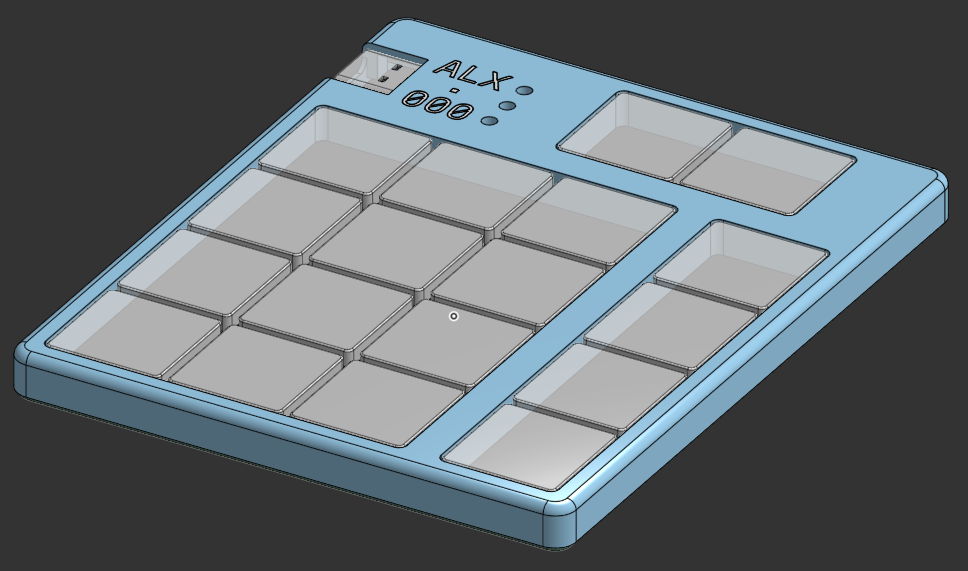

# ALX.000

ALX.000 is a compact 18-keys computer numpad, powered by a Seeed XIAO RP2040
micro-controller, and ultra-low-profile Kailh "X" PG1316S switches. It runs QMK,
although support for RMK may come later.

## What’s included here?

This repository contains all needed files for building the keyboard, including parts
list, assembly instructions and useful links.

- The [alx-000.json](alx-000.json) represents the keyboard shape,
produced by [Keyboard-Layout-Editor](https://www.keyboard-layout-editor.com/##@_name=ALX.000&author=vegaelle%3B&@_x:1.5&t=%23ff0000&a:7%3B&=%E2%86%90&_t=%230000ff%3B&=%E2%86%92%3B&@_y:0.5&t=%23000000%0A%23ff0000&a:4%3B&=%0AHome%0A%0A%0A%0A%0A%0A%0A%0A7&=%0A%E2%86%91%0A%0A%0A%0A%0A%0A%0A%0A8&=%0APgUp%0A%0A%0A%0A%0A%0A%0A%0A9&_x:0.5%3B&=%0A,%0A%0A%0A%0A%0A%0A%0A%0A%2F%2F%3B&@=%0A%E2%86%90%0A%0A%0A%0A%0A%0A%0A%0A4&_t=%23000000&a:7&n:true%3B&=5&_t=%23000000%0A%23ff0000&a:4%3B&=%0A%E2%86%92%0A%0A%0A%0A%0A%0A%0A%0A6&_x:0.5%3B&=%0A%2F=%0A%0A%0A%0A%0A%0A%0A%0A*%3B&@=%0AEnd%0A%0A%0A%0A%0A%0A%0A%0A1&=%0A%E2%86%93%0A%0A%0A%0A%0A%0A%0A%0A2&=%0APgDn%0A%0A%0A%0A%0A%0A%0A%0A3&_x:0.5%3B&=%0A%3F%0A%0A%0A%0A%0A%0A%0A%0A-%3B&@=%0ABack%0A%0A%0A%0A%0A%0A%0A%0AEnt&=%0AIns%0A%0A%0A%0A%0A%0A%0A%0A0&=%0ADel%0A%0A%0A%0A%0A%0A%0A%0A.&_x:0.5%3B&=%0A%3F%0A%0A%0A%0A%0A%0A%0A%0A+)
- The [kicad](kicad/) directory contains the Kicad project, representing the PCB. It
uses [Scottokeebs](https://github.com/joe-scotto/scottokeebs/tree/main/Extras/ScottoKicad) libraries and [Mikefive](https://github.com/mikeholscher/zmk-config-mikefive/tree/main/files)’s footprints
- the PG1316 keycaps can be 3D-printed, either with the [blank model](pg1316s_keycap.3mf), or with the OpenSCAD script that allows customization, even with labels, in the [keycaps](keycaps) directory
- The case has been designed in [OnShape](https://cad.onshape.com/documents/826440f605c19707b80cd65a/w/c0d96e8d9f2b88321da9ff87/e/a88972e39d45dd27abd71d1e?renderMode=0&uiState=67a777fa368aed7a59f7b05c). I would have liked to make it in FreeCAD but even in 1.0, it simply wasn’t usable enough.
- The [qmk_firmware/keyoards/alx/000](qmk_firmware/keyboards/alx/000) directory contains
the keyboard definition for QMK, required to build the firmware and edit the keymap.

## Why design a numpad in the first place?

1. Because it’s fun
2. I ultimately want to design my own ergomech keyboard, and this simple project is a
   first step
3. I wanted to try those ultra-thin switches, and it will be a nice way to try those
